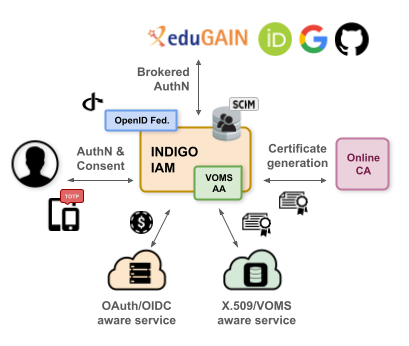

The INDIGO Identity and Access Management (IAM) Service is an **identity and access management** solution designed to support distributed scientific infrastructures and research communities.

IAM provides a central service where identities, enrollment, group membership, attributes and authorization information can be managed consistently across distributed resources and services.

IAM implements the **Virtual Organization** (VO) concept and builds on more than twenty years of experience with [VOMS][voms] (Virtual Organization Membership Service), which has traditionally provided membership and authorization information to Grid infrastructures using X.509 certificates and VOMS Attribute Certificates.

While preserving interoperability with existing X.509/VOMS-based infrastructures, IAM enables the transition towards modern, token-based Authentication and Authorization Infrastructures (AAIs).

IAM is the AAI solution chosen to power the next generation [WLCG][wlcg] Authentication and Authorization Infrastructure.

## Core capabilities

IAM acts as an **OAuth 2.0 Authorization Server** and **OpenID Connect Provider**, issuing tokens that applications and services can use for authentication and authorization.

It supports the integration of web applications, APIs and command-line tools, allowing the same IAM-managed identity and authorization information to be consumed across different environments.

IAM supports different token profiles to address the interoperability requirements of different infrastructures and communities, including:

* the native IAM profile;
* the WLCG JWT profile;
* the AARC profile;
* a Keycloak-oriented profile.

These profiles determine how identity, authentication, group membership and authorization information is represented in tokens and related OAuth/OpenID Connect responses.

## Authentication and identity brokering

IAM provides **flexible authentication** and can act as an authentication broker between users, external Identity Providers and relying services.

Users can authenticate using:

* local username and password credentials;
* SAML Identity Providers and identity federations;
* external OpenID Connect Providers;
* X.509 certificates.

Multiple authentication credentials can be linked to the same IAM account. This allows users to access the same identity and VO membership regardless of the authentication mechanism used.

IAM also supports **Multi-Factor Authentication** (MFA), providing stronger authentication when required by the IAM organization or by the services consuming IAM identities.

## Enrollment and membership management

IAM provides both **moderated** and **automatic enrollment** mechanisms for joining an IAM-managed organization.

Once enrolled, IAM manages the user's membership information, including:

* groups;
* roles;
* attributes and labels;
* organization-specific authorization information.

IAM can also enforce the acceptance of an **Acceptable Usage Policy** (AUP) as part of the membership lifecycle.

Together, these capabilities allow IAM to represent not only who a *user* is, but also *which organization or groups the user belongs* to and *which capabilities should be exposed to relying services*.

## Token-based and X.509 infrastructures

IAM is designed to support the transition from traditional X.509/VOMS-based infrastructures to OAuth 2.0 and OpenID Connect token-based authorization.

For OAuth/OIDC-aware services, IAM issues **JWT access tokens** carrying identity, membership and authorization information.

For services that still rely on X.509 and VOMS credentials, IAM can integrate with a **VOMS Attribute Authority** to expose IAM membership information through standard VOMS Attribute Certificates.

IAM can also integrate with an **online Certificate Authority** to support on-demand X.509 certificate generation.

This allows the same IAM-managed identity and membership information to be consumed by both modern token-based services and legacy X.509/VOMS-aware services.

## User provisioning and APIs

IAM exposes a rich set of REST APIs for managing and retrieving information about users, groups, memberships, clients, tokens and authorization policies.

It also provides a **[SCIM](scim) interface** that can be used to provision IAM identity and membership information to external services. This enables, for example, the creation or synchronization of local accounts based on centrally managed IAM information.

## Integrations

IAM has been successfully integrated with many off-the-shelf components such as OpenStack, Kubernetes, Atlassian JIRA and Confluence, and Grafana, as well as with key scientific and Grid computing services including [RUCIO][rucio], [FTS][fts], [dCache][dcache], [StoRM][storm], [XRootD][xrootd] and [HTCondor][htcondor].

## Service deployment

IAM is an **Apache-licensed Java application** based on the **Spring Boot** framework.

The service is typically deployed using containers and can run in Kubernetes environments. High-availability deployments are supported, allowing multiple IAM instances to serve the same organization.

Docker images and RPM packages are provided for deploying IAM on premises. See the [Deployment guide][deployment-guide] for additional information.

[deployment-guide]: 
[rucio]: https://rucio.cern.ch/
[voms]: https://italiangrid.github.io/voms
[wlcg]: https://wlcg.web.cern.ch/
[fts]: https://fts.web.cern.ch/fts/
[xrootd]: https://xrootd.slac.stanford.edu/index.html
[htcondor]: https://research.cs.wisc.edu/htcondor/
[dcache]: https://www.dcache.org/
[storm]: https://italiangrid.github.io/storm
[scim]: https://datatracker.ietf.org/doc/html/rfc7644
