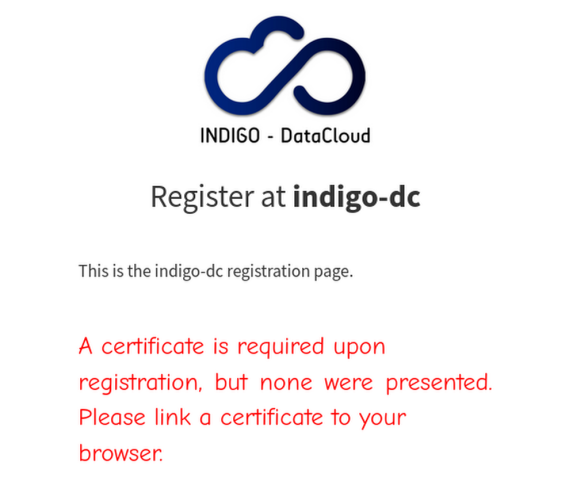
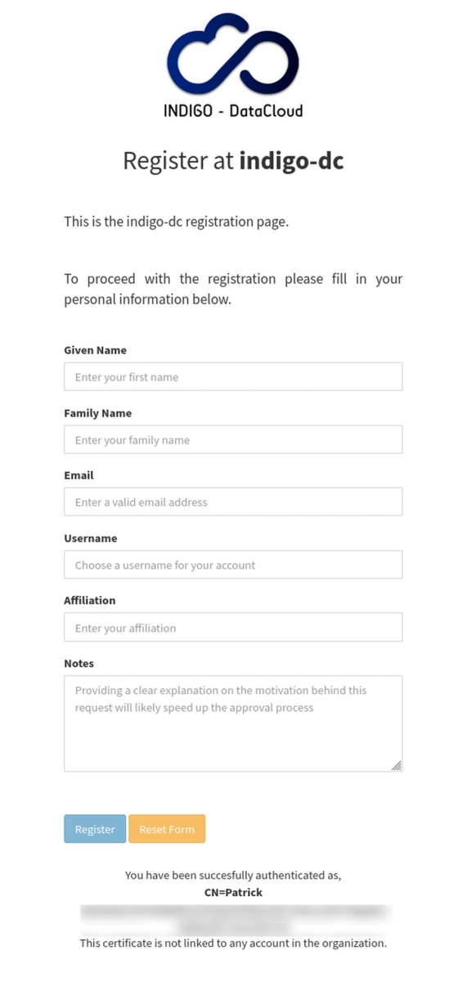
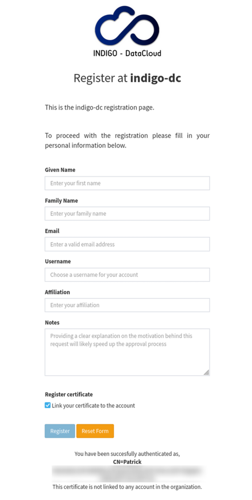
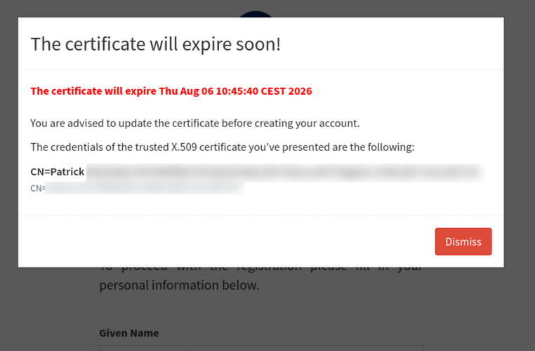
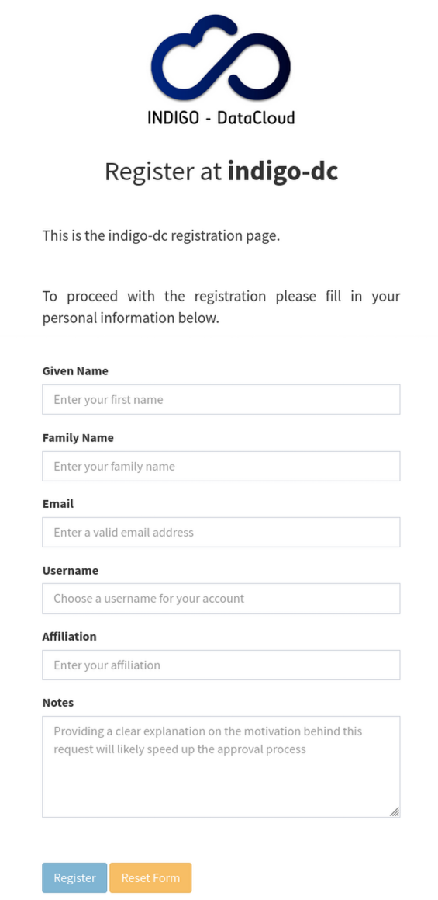
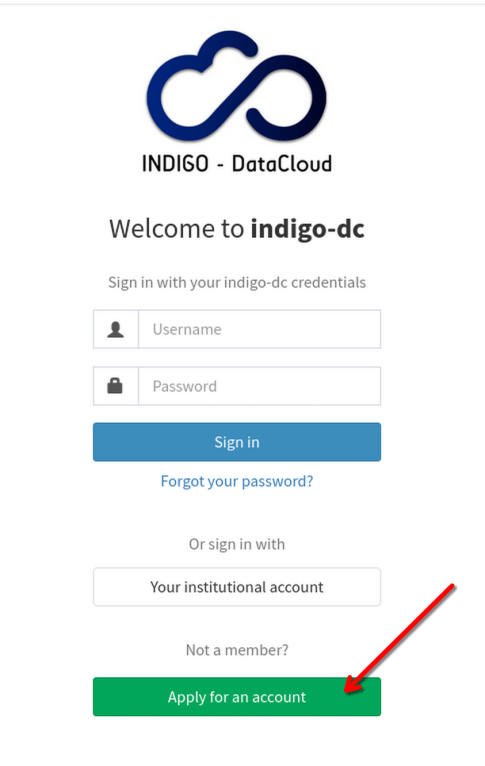

IAM implements a basic registration service that requires the intervention
of an IAM admin. In fact, when users apply for membership in an
organization, administrators are asked to validate membership requests.


## Registration with external IdP

When an external OIDC or SAML IdP is used to authenticate users, IAM allows to configure:

- Whether users are required to authenticate through an external IdP and optionally
  which ones
- Which information must be retrieved from the IdP to fill the account creation form

This is done by creating a YAML file in `/indigo-iam/config`, for example
`/indigo-iam/config/application-registration.yaml`. When deploying IAM with a container,
a volume providing this file must be mapped into the container.

The contents in this file must be under the following hierarchy:

```yaml
iam:
  registration:
```


### Requiring external authentication

To require that users must authenticate through an external IdP, you need to set the
parameter `require-external-authentication=true`. You can also specify the type of external
IdP (`oidc` or `saml`) and require one specific issuer.

The following fragment is an example of authentication with the
(OIDC-based) CERN SSO required before being redirected to the registration page.
It also defines how information from identity tokens issued by CERN SSO is
mapped to IAM membership information

```yaml
iam:
  registration:
    require-external-authentication: true
    oidc-issuer: https://auth.cern.ch/auth/realms/cern
    authentication-type: oidc
```

### Filling information from IdP

The first time a user authenticates in an IAM instance, the account creation form will be displayed. It is possible to request
that some of the fields are filled with the value of an IdP attribute and to define that some of these fields are read-only,
i.e. that the value provided by the IdP cannot be changed.

To enable filling the creation form with values provided by the IdP, you need to create a YAML file in `/indigo-iam/config`, for example
`/indigo-iam/config/application-registration.yaml`. The contents should be something similar to:


```yaml
iam:
  registration:
    fields:
      name:
        read-only: false
        field-behaviour: mandatory
        external-auth-attribute: given_name
      surname:
        read-only: false
        field-behaviour: mandatory
        external-auth-attribute: family_name
      email:
        read-only: false
        field-behaviour: mandatory
        external-auth-attribute: email
      username:
        read-only: false
        field-behaviour: mandatory
        external-auth-attribute: suggested_username
      affiliation:
        read-only: false
        field-behaviour: optional
      notes:
        read-only: false
        field-behaviour: mandatory
      certificate:
        read-only: false
        field-behaviour: hidden
```

`read-only` can be set to `true` if you want to prevent that the  value provided supplied by the ID is modified by the user.
**Note that if a field is defined as `read-only=true` and now value is not provided
by the IdP, it may result that the user cannot submit the account creation form if the field,
when it is required.**

`external-auth-attribue` must be the name of the IdP attribute, or token claim (when provided by SAML IdPs,
or OIDC Providers, respectively) to use for the mentioned account creation form field.

## Allowing for certificate linking upon registration

Within the registration fields, is the field `certificate`. While it may be within the same group as the other fields, its 
behaviour is a bit different from the others. Firstly, it does inherit the same attributes being `read-only`, `field-behaviour` and
`external-auth-attribute`, but only `field-behaviour` is to be configured for this field. 

Configuring `read-only` or `external-auth-attribute` would be to assume that the IdP provides information of whether the certificate of the user should be linked or not.
Therefore, it's strongly discouraged to configure `read-only` to anything but `false`, given that, as previously mentioned, this could lead to the user
not being able to register, as this information is not provided by the IdP (and Indigo IAM has currently not been configured to handle this,
even if provided).

The `field-behaviour` can be defined as `mandatory`, `optional`, or `hidden`. 
Each of the options brings different behaviour to the registration page. 

**In general for linking the certificate upon registration, a certificate needs to be present in the browser. Make sure to have linked one before attempting the registration.**

### Certificate field being `mandatory`
If the certificate field is `mandatory`, then the user must link a certificate upon registration.<br>
If no certificate is present whilst attempting the registration, then the following error will appear. 



The error text can change if the certificate is present, but is linked to a suspended account or another account in general.

Given that the certificate is present and valid, then the following registration page should be rendered.<br> 
Please note the certificate information displayed at the bottom of the page. 



### Certificate field being `optional` 

If the certificate field is `optional`, then the user may link a certificate upon registration if one is present and valid. 

The following is an example of this. Please take note of the checkbox at the end of the registration form.



One will only be able to check the checkbox if the certificate is valid.

If the certificate presented is within 1 month of expiration, then the following pop-up window is shown to the user.<br>
The *almost expired* pop-up window is also enabled for the registration field being `mandatory`. 



### Certificate field being `hidden`
If the certificate field is `hidden`, then the user does not have the option to link their certificate upon the registration request
(nor does one have to be present upon registration). <br>

The checkbox is hidden from the user and no certificate is required. <br>
Please note the absence of certificate information at the bottom of the page.



## Automatic enrollment through SAML/OIDC IdPs

In case of registration through an external SAML/OIDC Identity Provider, IAM offers
a flexible user enrollment flow, also without IAM admin intervention. The default IAM
behavior is that the user enrollment requires an administrator approval step.

### SAML

In order to enable the automatic enrollment flow via an external IdP, one
should set the following properties, under the `saml` hierarchy:

```yaml
saml:
  jit-account-provisioning:
    enabled: true
    # this default behavior considers all IdPs declared in your
    # application-saml.yml file as trusted
    trusted-idps: all
```

If one wants to select a subset of trusted SAML IdPs, a comma separated list of entity
IDs have to be set, e.g.

```yaml
saml:
  jit-account-provisioning:
    trusted-idps: https://idp1.test.example,https://idp2.test.example,https://idp3.test.example
```

### OIDC

In order to enable the automatic enrollment flow via an external OIDC Provider, one
should set the following properties, under the `oidc` hierarchy:

```yaml
oidc:
  jit-account-provisioning:
    enabled: true
    # this default behavior considers all IdPs declared in your
    # application-oidc.yml file as trusted
    trusted-idps: all
```

If one wants to select a subset of trusted OIDC Providers, a comma separated list of entity
IDs have to be set, e.g.

```yaml
oidc:
  jit-account-provisioning:
    trusted-idps: https://google.test.example,https://facebook.test.example,https://github.test.example
```

## User editable fields

Starting with version 1.6.0, IAM allows to limit which fields of the user profile are editable by users.

The default, backward-compatible settings that allow users to edit all their
profile fields are defined as follows:

```yaml
iam:
  user-profile:
    editable-fields:
      - email
      - name
      - picture
      - surname
```

To prevent modifications to any of the fields remove the field name from
`editable-fields` list.

External configuration can be managed by placing directives as shown above in a
[custom configuration
file][custom-config-file]


## Automatically set the nickname as attribute

Since IAM v1.9.0, during a registration request the username can be automatically added as an attribute named _nickname_. This process happens both for login with external provider, or when one directly clicks on the
_Apply for an account_ button.
The _nickname_ value will be the same as the username set during the registration request.

This behavior does not appear by default. To enable it, add to your config file

```yaml
iam:
  registration:
    add-nickname-as-attribute: true
```

or set the environment variable `IAM_ADD_NICKNAME_AS_ATTRIBUTE=true`.

Once the new IAM user has been created, the _Attributes_ view from the dashboard looks like the following


[custom-config-file]: 


## Configuring the registration button

One can configure the visability of the registration button and its text via the following variables in the config file

```yaml
iam:
  registration:
    show-registration-button-in-login-page: true
    registration-button-text: Apply for an account
```
The defualt configuration is defined as written above and can also be defined via the environment variables `IAM_REGISTRATION_SHOW_REGISTRATION_BUTTON_IN_LOGIN_PAGE` and `IAM_REGISTRATION_BUTTON_TEXT`.

The aforementioned configuration of the registration button would result in it being rendered as seen below. 

