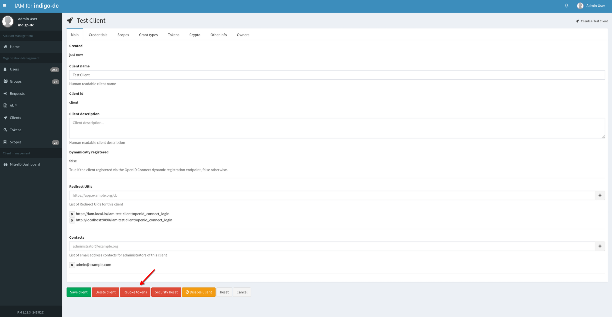
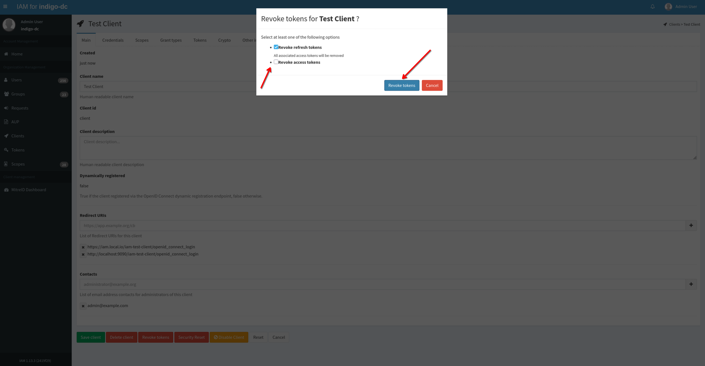
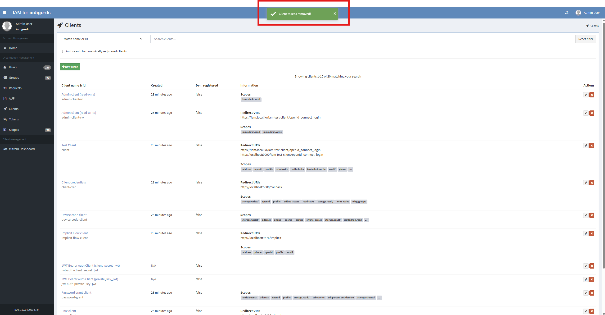
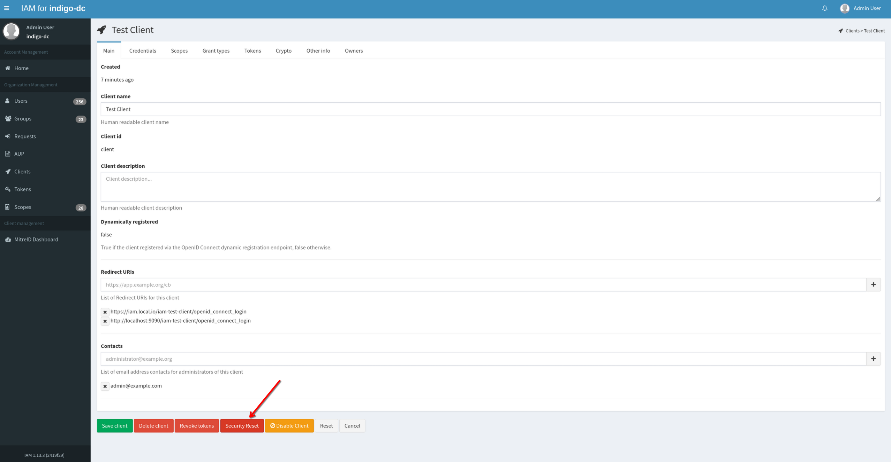
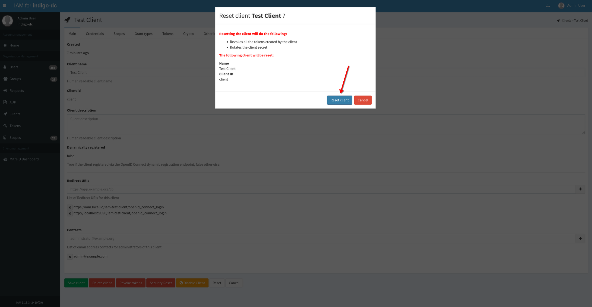
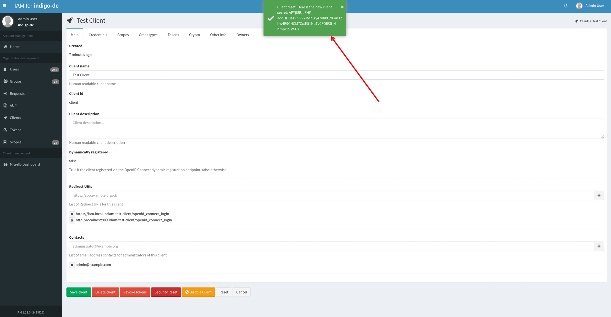

Existing clients can have their tokens revoked by an Administrator from dashboard.

## Revoke selected tokens

Log into the service using Admin credentials and click on the _Clients_ link on the left
navigation bar:

From the _Clients_ link, select the Client you want to disable, for example _Test Client_:

To revoke the client's tokens click on the _Revoke tokens_ button on the bottom of the page:

A pop-up window will appear: to specify which tokens you want to remove, select the corresponding checkbox.
To confirm your choice click on the _Revoke Tokens_ button on the modal window:

On success you will get a confirmation message and you will be redirected to the clients page:

## Security reset

A security reset will revoke all the tokens issued to that Client and rotate the Client secret.
The intention of this is that given one knows the Client has been compromised, then it is easily and quickly possible to reset all access for that given Client.

Log into the service using Admin credentials and click on the _Clients_ link on the left
navigation bar:

From the _Clients_ link, select the you want to disable, for example _Test Client_:

To revoke all tokens issued to the Client and to rotate the Client secret click on _Security Reset_ button on the bottom of the page:

To confirm your choice click on the _Reset Client_ button on the modal window:

On success you will get a confirmation message which displays the new client secret of the client that was reset:

