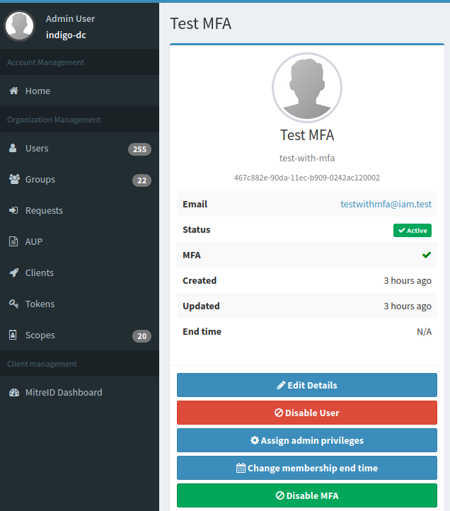
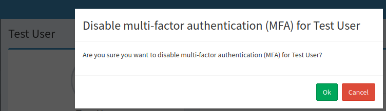

To enhance account security and align with modern security standards, Multi-Factor Authentication (MFA) has been introduced in the INDIGO IAM service.

MFA allows users to add an additional layer of security by registering a second authentication factor. Once enabled, a single credential will no longer suffice for login access.

The primary goals of MFA are:

* **Strengthening security**: Reducing the risk of unauthorized access, even if login credentials are compromised
* **Compliance**: Meeting client security policies that mandate the use of multi-factor authentication

To enable MFA, the `mfa` INDIGO IAM profile must be configured.

{}
**MFA support is experimental**.
It is applicable to login with username and password, login with SAML/OIDC external providers, login with X.509 certificates.
{}

## Problems with the authenticator app

If users experience issues with their authenticator app, they can request IAM administrators to disable MFA on their behalf.

Administrators should go to the user’s homepage and click the _Disable MFA_ button.

A confirmation dialogue will appear. Click _Ok_ to finalize the process.

Once completed, MFA will be disabled for the user, allowing them to log in without the second authentication factor.
