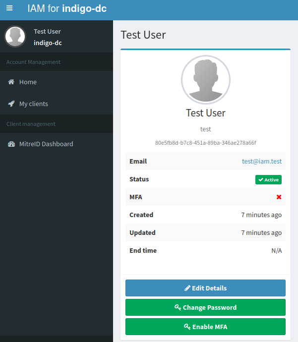
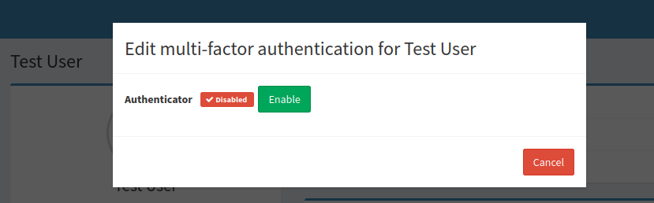
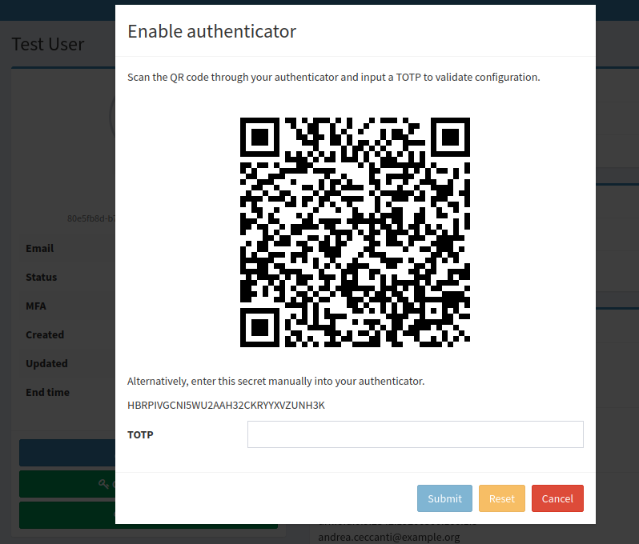
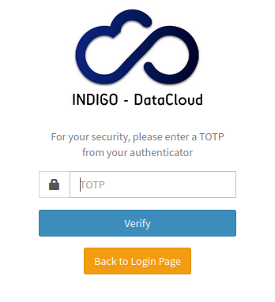
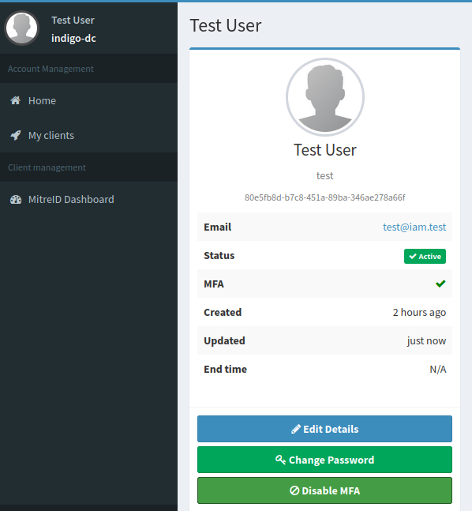
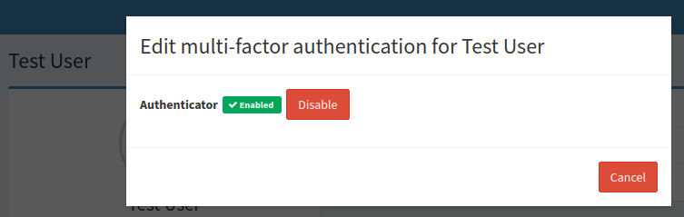
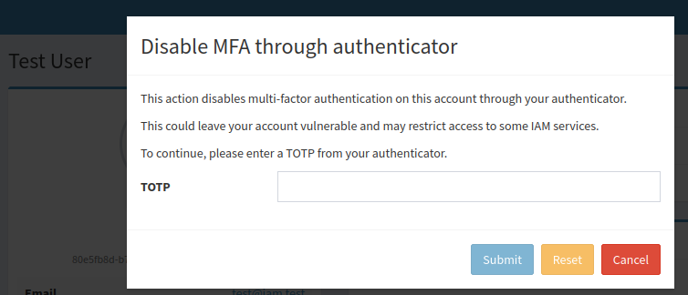

To enhance account security and align with modern security standards, Multi-Factor Authentication (MFA) has been introduced in the INDIGO IAM service.

## How to enable MFA

Authenticated users can enable MFA through a button in their homepage.

Steps to enable MFA:

1. **Click the _Enable MFA_ button**

    

    Then, click on _Enable_.

    

2. **Confirm activation**

    A dialogue box will appear, prompting the user to enter a Time-based One-Time Password (TOTP) generated by an authenticator (e.g., _Ente Auth_ app).

    

3. **Submit the TOTP**

    Enter the TOTP into the field provided and click _Submit_. If the code is correct, MFA will be successfully enabled.

4. **Login with MFA**

    Once MFA is enabled, each login will require:

    * A primary authentication method (e.g., username and password, SSO or X.509 certificate)
    * A second factor (the TOTP) entered on a follow-up page

    

## How to disable MFA

Users can disable MFA by following these steps:

1. **Click on _Disable MFA_ button**

    

    Then, click on _Disable_.

    

2. **Confirm deactivation**

    A dialogue box will appear, prompting the user to enter the TOTP.

    

3. **Submit the TOTP**

    Enter the TOTP into the field provided and click _Submit_. If the code is correct, MFA will be successfully disabled.  
    From this point forward, the user will no longer need to provide a second authentication factor during login.

## Problems with the authenticator app

If users experience issues with their authenticator app, they can request IAM administrators to disable MFA on their behalf and then setup again the TOTP.

